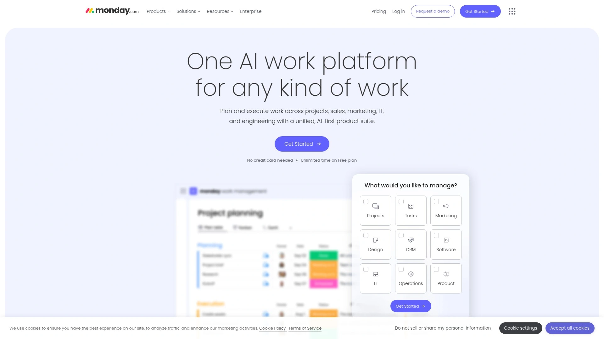
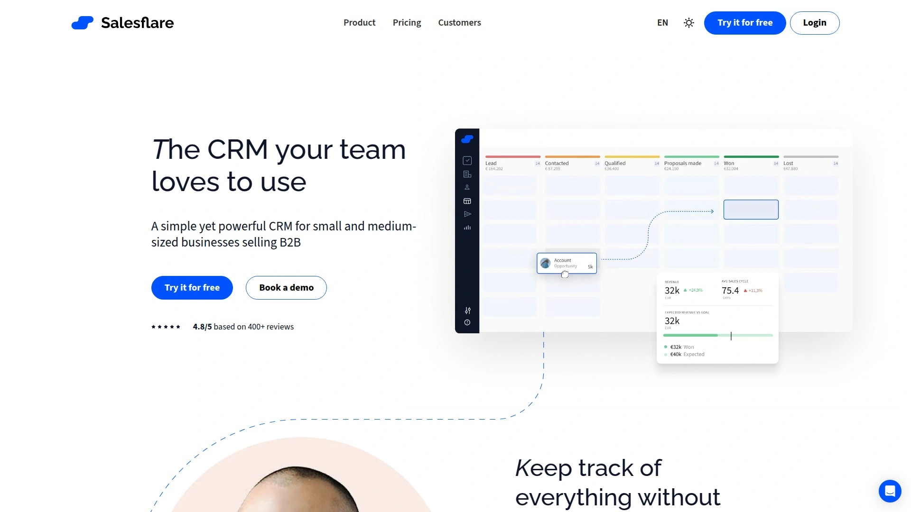
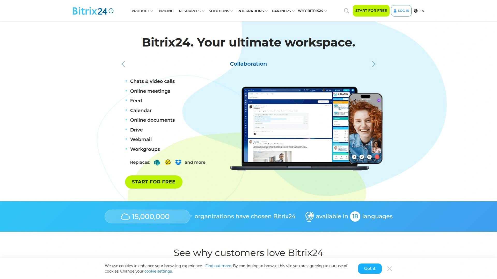

# Top 25 CRM Software Solutions Ranked in 2025 (Latest Compilation)

In today's fast-paced business world, the right **CRM software** can make all the difference in nurturing customer relationships and closing deals. Many small businesses and sales teams still struggle with scattered spreadsheets or clunky tools that slow them down. This roundup tackles those pain points by highlighting **CRM solutions** that streamline **contact management**, automate follow-ups, and keep your sales pipeline on track. From AI-driven assistants to simple no-fuss interfaces, there's a platform here for every workflow – helping you save time, stay organized, and focus on growth.

## [Folk](https://www.folk.app)
*AI-driven contact management that acts like a 24/7 assistant for growing teams.*

**Folk** is an AI-powered CRM built to act like your team's personal assistant. It automatically enriches contacts (pulling in emails, social profiles, etc.) and even suggests follow-ups so you never miss a beat. The platform connects with Gmail, LinkedIn, calendars and more, capturing all your interactions without manual data entry. Teams love Folk for its collaborative pipelines and simple interface that feels more like a smart contact list than a bulky corporate database. If you’re a growing business that values relationships, Folk keeps your outreach personal while saving you time on tedious tasks.

## [Close](https://www.close.com)
*All-in-one sales CRM with built-in calling, automation, and a focus on speed for small teams.*

- **Built-in calling & email** – Close includes a power dialer and one-click SMS/email sequences to reach leads faster, all from within the CRM.
- **Sales automation** – Automate lead assignments, follow-up reminders, and even lead scoring so reps can focus on selling, not admin work.
- **Seamless integrations** – It connects with Gmail, Zoom, Slack, and more (plus Zapier for everything else) to fit into your existing workflow.
- **Who it’s for** – Small and mid-size teams that want a *powerful yet user-friendly* sales tool. Close packs enterprise-level features into an intuitive package, making it ideal for startups and agencies aiming to close deals faster.

## [Monday.com](https://monday.com)
*Highly customizable Work OS that doubles as a CRM – build your perfect pipeline your way.*

**Monday.com** isn't a traditional CRM; it's a flexible Work OS that you can tailor to any workflow – including sales. Using drag-and-drop boards and templates, teams build custom pipelines to track leads, customers, or projects exactly how they want. You can switch views (kanban board, calendar, timeline, charts) to visualize your progress and collaborate with colleagues in real time on each deal. Because Monday is so adaptable, it's as handy for a marketing campaign or hiring pipeline as it is for classic contact management. If your business needs a CRM that molds to *your* process (instead of the other way around), Monday delivers that freedom with style.

## [HubSpot CRM](https://hubspot.com)
*Powerful all-in-one platform for CRM, marketing, and support – from first touch to loyal customer.*

- **Full customer platform** – HubSpot combines a robust free CRM with optional Marketing, Sales, and Service Hubs. Manage contacts and deals while also running email campaigns, building landing pages, and even handling customer support tickets in one system.
- **Free and scalable** – The core CRM features (contacts, pipelines, reporting) are free to start. As you grow, you can add paid hubs for advanced marketing automation, sales tools, or customer service – scaling up when needed.
- **Robust analytics** – Track every interaction from a lead’s first website visit to the final sale. HubSpot’s dashboards let you monitor email opens, pipeline velocity, campaign ROI, and more with polished reports.
- **Extensive ecosystem** – Integration is a non-issue; HubSpot connects with hundreds of popular apps (and its own app marketplace) so it fits into any tech stack.
- **Why use it?** – HubSpot is an industry leader for a reason. It’s user-friendly yet extremely **feature-rich**, making it a go-to CRM for businesses from startups to enterprises that want everything under one roof.

## [Funnel CRM](https://funnelcrm.io)
*Lightweight pipeline CRM to capture leads and send proposals without the bloat.*

**Funnel CRM** focuses on simplicity, offering an easy way to capture and follow up on leads without the bulk of an enterprise system. Users can embed custom contact forms on their website that feed directly into Funnel CRM, making lead collection a breeze. Once leads are in, you can organize contacts, track your sales pipeline, and even send out proposals or quotes from within the app. The interface is straightforward and uncluttered, meaning even non-technical users (like busy solopreneurs or small agencies) can hit the ground running. If you need a no-frills tool to turn inquiries into closed deals, Funnel CRM keeps you organized *without* overwhelming you.

## [Salesmate](https://www.salesmate.io)
*Unified sales & marketing CRM that keeps prospects engaged at every step.*

**Salesmate** blends CRM and marketing automation so you can manage your pipeline *and* nurture leads in one place:

- Visual deal pipelines with drag-and-drop stages to track sales opportunities from start to finish.
- Bulk email and SMS campaign tools, complete with personalized sequences for automating your outreach and follow-ups.
- Workflow automation to offload repetitive tasks (like sending meeting reminders or updating deal statuses) and keep your team efficient.
- Real-time sales insights and goal tracking dashboards to monitor performance and forecast results.

This platform is great for businesses looking to combine outreach and pipeline tracking under one roof instead of juggling separate tools.

## [Zoho CRM](https://www.zoho.com/crm/)
*Feature-rich CRM veteran offering deep customization and an entire ecosystem of integrated apps.*

**Zoho CRM** is a seasoned player that offers an impressive breadth of features and flexibility. It handles everything from lead and contact management to deal tracking, workflow automation, and advanced analytics. You can engage customers across email, phone, live chat, and social media all within Zoho CRM, ensuring no channel slips through the cracks. It’s part of the larger **Zoho ecosystem of 45+ apps**, which means your CRM can seamlessly connect to Zoho’s marketing tools, customer support desk, finance apps, and more. Whether you’re a small business or an enterprise, Zoho’s modular approach lets you tailor the CRM to fit your processes perfectly – with options to add custom fields, automate any step, and integrate with just about anything. It’s a one-stop shop for those needing a highly adaptable solution.

## [Pipedrive](https://www.pipedrive.com)
*Visual pipeline CRM known for its intuitive drag-and-drop deal tracking.*

**Pipedrive** is all about the pipeline (it's in the name!). The heart of this CRM is an **interactive sales pipeline** view that makes it almost fun to manage your deals – just drag and drop opportunities through stages as they progress. Pipedrive also offers handy extras like web forms for easy lead capture, email integration to track conversations automatically, and smart automation to assign tasks or send follow-up emails when a deal moves forward. Its reporting dashboards help you spot bottlenecks and forecast revenue at a glance. For teams that want a focused, easy-to-adopt CRM to boost deal closure rates without a steep learning curve, Pipedrive is a top contender.

## [Capsule](https://capsulecrm.com)
*Clean and simple CRM that covers the essentials of contact management for small teams.*

**Capsule** has quietly built a loyal following by focusing on the essentials done right:

- **Contact-centric organization** – Store every detail about your leads, customers, and vendors, with notes and tags to keep things tidy. It’s straightforward to log interactions and find a contact’s history.
- **Straightforward sales tracking** – Manage opportunities through a simple pipeline. Capsule lets you set up deal stages and track where each opportunity stands without unnecessary complexity.
- **Email integration** – Connects with Gmail, Outlook, and others, so emails to a contact can be easily captured in their timeline. No more digging through inboxes to remember who said what.
- **Lightweight automation** – While Capsule is simple, it’s growing; new automation features (in beta) help cut down on repetitive tasks. It also integrates nicely with popular apps like Mailchimp, Xero, and Zapier to extend its power.
- **User-friendly interface** – The UI is clean and uncluttered. If you’ve seen one too many bloated CRM screens, Capsule’s minimalist design will be a breath of fresh air, making adoption easier for everyone.

In short, Capsule covers the CRM basics with elegance, making it a great choice for small teams that want simplicity and usability above all.

## [Nimble](https://www.nimble.com)
*Social-savvy CRM that builds rich contact profiles and keeps you connected across channels.*

**Nimble** stands out by automatically pulling in your contacts’ social media and online info to create rich, up-to-date profiles. Connect Nimble to your email and social accounts, and it will merge conversations and updates from LinkedIn, Twitter, Facebook, and more – giving you a 360° view of each relationship. It’s great for small businesses and professionals who do a lot of networking; Nimble will even remind you to re-engage with people you haven’t talked to in a while. On the sales side, it provides deal tracking and task reminders, but the real magic is how it consolidates all your communications in one place. If your client outreach spans email **and** social channels, Nimble makes sure no interaction falls through the cracks.

## [Insightly](https://www.insightly.com)
*CRM meets project management – track your sales pipeline and the projects that follow, all in one.*

**Insightly** combines sales and project management, making it ideal if you need to deliver projects after winning a deal:

- Standard CRM functions like contact management, opportunity tracking, and task assignments are baked in with an easy-to-use interface.
- A project management module lets you convert a won deal directly into a project with milestones, tasks, and timelines – ensuring you fulfill what you sold.
- Deep integration with G Suite and Microsoft 365 means emails and calendar events sync right into Insightly. There’s also a handy mobile app, so you can update deals or projects on the go.
- Custom dashboards and reports help you monitor sales KPIs *and* project progress side by side, giving you full visibility from initial lead to delivered work.

In short, Insightly helps you not only win business but also manage the work that comes after. It streamlines the *entire* customer lifecycle, from the first contact to final delivery, in a single tool.

## [Keap](https://keap.com) (Infusionsoft)
*Small-business CRM + marketing automation that captures, nurtures, and converts leads on autopilot.*

**Keap** (formerly Infusionsoft) is built for entrepreneurs and small businesses that need to automate their client follow-ups and marketing without losing the personal touch. It combines a robust contact manager with tools to send email campaigns, schedule appointments, and even process invoices and payments. Keap’s secret sauce is its automation engine – you can **design personalized workflows** so that when a new lead comes in, the system might automatically send a welcome email series, assign the lead to a sales rep, and create a follow-up task, all without you lifting a finger. This tight integration of CRM and marketing means you spend less time jumping between apps and more time engaging customers. For small teams aiming to grow (without hiring an army of assistants), Keap feels like an extra team member handling the busywork and keeping your sales pipeline humming.

## [Agile CRM](https://www.agilecrm.com)
*Affordable all-in-one CRM for sales, marketing, and service – a startup-friendly powerhouse.*

**Agile CRM** lives up to its name by offering a nimble, all-in-one solution spanning sales, marketing, and customer service. It packs a surprising amount of functionality: manage contacts and deals, set up automated email campaigns and web forms, even handle support tickets – all from one dashboard. Small teams love the price point (Agile has a free tier and **affordable paid plans**) because it delivers capabilities similar to bigger suites without the sticker shock. You can automate repetitive tasks easily, like sending a thank-you email after a customer signs up or scheduling follow-ups for cold leads. While Agile CRM might not have the flashiest interface, it provides a lot of bang for your buck. For startups and small businesses watching the bottom line, Agile CRM offers robust features in one consolidated platform, proving you don’t need to sacrifice functionality for cost.

## [EngageBay](https://www.engagebay.com)
*All-in-one CRM + Marketing + Support suite built as an affordable HubSpot alternative.*

**EngageBay** positions itself as the budget-friendly alternative to big names, combining marketing, sales, and support tools in one unified platform. With EngageBay, you get a CRM to track contacts and deals, a marketing hub to send newsletters or build landing pages, and even a service desk module for customer support – all working together seamlessly. The platform offers a generous free plan and low-cost upgrades, making features like marketing automation and lead scoring accessible to businesses on a shoestring budget. Despite its lower price, EngageBay doesn't skimp on functionality: you can set up drip email campaigns, capture leads via web forms and popups, and monitor every interaction a contact has with your business. For small businesses that want **marketing, sales, and support tools in one** (without the enterprise price tag), EngageBay is a strong contender that punches above its weight.

## [Freshsales](https://www.freshworks.com/crm/) (Freshworks CRM)
*AI-enhanced CRM from Freshworks that excels at lead scoring and communication.*

**Freshsales** leverages AI to help sales teams focus on the right leads:

- Intelligent lead scoring with *Freddy AI* – The system automatically ranks and prioritizes leads based on their engagement and profile, so you know who’s most likely to convert next.
- Built-in phone and email integration – Make calls or send emails right from Freshsales; every conversation is logged under the contact automatically, and you can even auto-dial numbers or use email templates to save time.
- Visual deal pipelines and customizable dashboards – Track your deals in a kanban-style pipeline and tweak the analytics dashboards to display key metrics (like win rates or revenue forecasts) that matter to your business.
- Part of the Freshworks suite – Freshsales plays nicely with its siblings like Freshdesk (customer support) and Freshmarketer (marketing automation). This means you can achieve a 360° customer view by connecting sales with support and marketing data easily.

In short, Freshsales offers a modern, user-friendly CRM with a lot of brainpower under the hood. It’s great for teams that want data-driven sales insights (thanks to AI features) without complicating the user experience.

## [Copper](https://www.copper.com)
*Google Workspace-centric CRM that fits seamlessly into Gmail, Calendar, and Drive.*

**Copper** is the CRM solution that Google Workspace users will feel right at home with. In fact, Copper is officially recommended for G Suite because it **integrates tightly with Gmail, Calendar, and Drive**. You can manage leads and track deals *without leaving your inbox* – Copper’s tools live inside Gmail, automatically logging emails and letting you add contacts or update deal stages from the sidebar. But it’s not just an email plugin; behind the scenes you still get a full-featured CRM with contact histories, task reminders, and pipeline dashboards. The beauty is in the familiarity: if you know how to use Gmail, you basically know how to use Copper. For teams that run on Google apps and want a CRM that meshes into their daily routine instead of disrupting it, Copper is a no-brainer.

## [Streak](https://www.streak.com)
*CRM built entirely inside Gmail – track pipelines and contacts from your inbox.*

**Streak** takes a unique approach by turning your Gmail inbox into a CRM. Instead of using a separate app, Streak adds pipeline management and contact tracking right inside the Gmail interface. You can manage leads, set reminders, and even do mail merge campaigns from your regular email window. For example, you might have a "Deals" pipeline that appears alongside your emails, with stages like Prospect, Pitched, and Closed – you simply move an email thread along those stages as you progress with a client. It’s minimalistic but surprisingly effective for solo users and small teams who practically live in their inbox. If you appreciate simplicity and don’t want to constantly switch between email and another CRM dashboard, Streak is an **elegant solution** that keeps things simple and in one place.

## [Salesflare](https://salesflare.com)
*“Zero-input” CRM that automatically logs data from your emails and calendar – less work, more sales.*

**Salesflare** is built for anyone who hates spending time on data entry (i.e., most of us). This smart CRM automatically gathers info about your leads and customers from your emails, calendar, and social media, so your CRM entries basically *fill themselves*. It logs when you last contacted someone, pulls in contact details from email signatures and public sources, and can even remind you to follow up with prospects that have gone quiet. Salesflare also provides nifty email tracking and website visitor insights – you’ll get notified when a lead opens your email or clicks your link, helping you time your follow-ups perfectly. It’s a sleek, modern tool that requires minimal effort to maintain, making it perfect for small B2B teams who’d rather focus on selling instead of constantly updating records.

## [Bitrix24](https://www.bitrix24.com)
*Free-to-start CRM packed into a collaboration suite (tasks, chat, docs) for all-in-one teamwork.*

**Bitrix24** offers a CRM and a whole lot more for teams that want everything in one place:

- **Full-featured CRM** – Manage leads, contacts, deals, quotes, and even invoices. Bitrix24’s sales tools are quite comprehensive, letting you go from prospecting to closing and billing without leaving the system.
- **Project management & tasks** – Assign tasks, create project workgroups, and link tasks to CRM deals. This helps sales and delivery teams stay on the same page about what happens after a sale.
- **Built-in communications** – Includes team chat, video conferencing, and an internal social feed. It’s like having Slack/Teams integrated directly with your CRM, so discussions and CRM records can go hand-in-hand.
- **Call center features** – You can integrate phone lines to make calls from Bitrix24 and automatically log them. Great if your team spends a lot of time on the phone with clients.
- **Generous free tier** – Bitrix24’s free plan supports a small company with basic CRM, project, and communication tools (and unlimited users on the free version). Paid plans unlock more automation and storage, but many startups can begin at no cost.

Bitrix24 packs a **suite of tools** under one roof, meaning you won’t need a dozen separate apps – CRM, tasks, chat, and more are all integrated. It can feel like a lot at first, but for organizations that want a one-stop platform for sales and internal collaboration, Bitrix24 is extremely compelling.

## [Apptivo](https://www.apptivo.com)
*Versatile business management suite with an integrated CRM for end-to-end customer tracking.*

**Apptivo** provides a modular suite of business apps, and its CRM module is at the heart of it. With Apptivo, you can manage the *entire customer journey*: generate leads, convert them to opportunities in the CRM, then after you close a deal, seamlessly create invoices, projects, or support tickets using Apptivo’s other modules. The CRM itself offers customizable pipelines, contact management, and flexible fields that you can tailor to your business (for example, a real estate agency could add property-specific fields, while an IT firm might track hardware details — it’s very adaptable). Because all the apps are under one roof, data flows smoothly from one stage to the next without duplicate data entry. If you want an all-in-one platform where CRM isn't an isolated tool but part of a bigger workflow, Apptivo lets you **manage the entire customer journey** in one place, from first touch to final invoice.

## [ActiveCampaign](https://www.activecampaign.com)
*Email marketing meets CRM – automate your sales funnel from first touch to repeat sales.*

**ActiveCampaign** is a top choice if your sales depend on nurturing leads through email and automation:

- **Marketing automation powerhouse** – ActiveCampaign lets you set up sophisticated automated sequences to **automatically nurture leads** via email, SMS, and more. It’s great for drip campaigns that warm up prospects over time.
- **Integrated CRM for sales** – Alongside the automation, ActiveCampaign includes a deal CRM. When a lead reaches a certain score or performs a key action (like requesting a demo), the system can automatically create a deal and assign it to a salesperson, ensuring no hot lead is missed.
- **Deep contact segmentation** – You can tag and segment contacts by behavior or attributes (e.g. tag those who clicked a specific link or visited your pricing page). This lets you send highly targeted follow-ups and know exactly where each lead stands in the buying journey.
- **Broad integrations** – From e-commerce platforms to CMS and webinar tools, ActiveCampaign connects with hundreds of apps. If a direct integration isn’t available, its robust API or tools like Zapier can bring data in and out effortlessly.

For businesses heavily focused on online marketing and need a seamless bridge to sales, ActiveCampaign ensures your prospects get timely, relevant touches and that your sales team is alerted at just the right moments. It’s a powerful blend of marketing and CRM that can significantly boost conversion rates when used to its fullest.

## [Less Annoying CRM](https://www.lessannoyingcrm.com)
*A refreshingly simple CRM that anyone can use – no fluff, no headaches, just the basics done well.*

**Less Annoying CRM** aims to be exactly what it sounds like: an uncomplicated, easy-to-use CRM without the confusing extras. In practice, that means a clean interface where you can add contacts, notes, tasks, and deals in seconds without wading through endless menus. It covers the basics solidly — you get a simple contact list, a leads pipeline, and a calendar for follow-ups, and not much else to distract you. The upside is that absolutely anyone can get started in minutes, and it runs fast even on an old computer or spotty Wi-Fi. It’s also one of the most budget-friendly options (a flat low monthly fee per user). If complex software makes your head spin and you just want a reliable place to track relationships and reminders, Less Annoying CRM lives up to its name and keeps things blissfully simple.

## [Nutshell](https://www.nutshell.com)
*User-friendly all-in-one CRM that blends sales and marketing features to help small teams sell smarter.*

**Nutshell** is a well-rounded CRM that combines sales and marketing capabilities while staying very approachable. On the sales side, it offers pipeline management with drag-and-drop deal boards, collaborative team selling tools, and even built-in quoting to streamline proposals. At the same time, Nutshell includes integrated email marketing tools (like automated drip campaigns and batch email sends), so you can nurture leads and keep in touch with customers without a separate email platform. Despite packing in dual functionality, the interface remains clean and easy to learn – most small teams find they can get the hang of Nutshell quickly, even without dedicated training. There’s also plenty of support available (tutorials, webinars, a helpful support team) if you need a hand. For a small to mid-sized business that wants robust capabilities across both sales and marketing, but with a gentle learning curve, Nutshell is an excellent choice that hits that balance nicely.

## [Kommo](https://www.kommo.com) (formerly amoCRM)
*Messaging-focused CRM specialized for conversational sales via WhatsApp, social, and chat.*

**Kommo** (formerly amoCRM) takes a modern approach to relationship management by centering on messaging and conversations. If a lot of your sales happen via chat apps, Kommo will be right up your alley – it natively integrates with WhatsApp, Facebook Messenger, Telegram, and more, pulling all those chats into your CRM. That means you can manage deals and talk to leads in real-time on their preferred channel, all from one interface. Kommo’s pipeline is highly visual and interactive (drag-and-drop stages, etc.), and it even offers a built-in chatbot builder to help you automate initial contact or capture leads when your team is offline. Of course, it still covers traditional CRM needs like contact and deal management, task reminders, and analytics. But the standout is how naturally it handles multi-channel communication. Companies that rely on quick back-and-forth messaging to close deals – think agencies, realtors, online sales via DMs – will appreciate how Kommo keeps *all* those dialogues organized in one hub.

## [Vtiger CRM](https://www.vtiger.com)
*Full-featured CRM suite with sales, marketing, and support modules – highly customizable for growing businesses.*

  

**Vtiger CRM** offers a comprehensive suite that covers sales, marketing, and customer support in a single platform. It’s a jack-of-all-trades CRM: you can generate and score leads, manage deals with a customizable pipeline, automate email campaigns to nurture prospects, and even handle customer support tickets after the sale. Vtiger is known for its flexibility — it’s highly configurable, from the data fields you use to the workflow rules and approval processes you can set. (It started in the open-source world, so that DNA of customizability is strong.) In recent versions, Vtiger has even added AI-driven insights, like predictive sales forecasting and automated next-step suggestions, features you’d expect only in higher-end CRMs. Despite its rich feature set, Vtiger keeps prices accessible and has an active community of users. If you need an all-encompassing CRM solution that you can tailor extensively *without* a Fortune 500 budget, Vtiger is a solid choice to round out our list.

---

**FAQ:**

- **Q: How do I choose the right CRM from this list for my business?**
  **A:** Start by identifying your team’s needs. If you require heavy marketing automation or an all-in-one suite, look at options that provide those (e.g. HubSpot or ActiveCampaign). If simplicity and quick setup are top priority, a straightforward tool like Less Annoying CRM or Streak might be best. Consider where your pain points are (too much manual data entry, poor follow-up tracking, etc.) and pick a CRM that excels in those areas. Most importantly, take advantage of free trials to see which interface your team adapts to and likes using day-to-day.

- **Q: Can I try these CRM platforms for free before committing?**
  **A:** Absolutely. Many of the tools listed offer a free tier or at least a free trial. For instance, HubSpot and EngageBay have free plans with core features enabled. Others like Pipedrive, Close, and **Folk** offer free trial periods so you can test all features with your data. It’s a good idea to pilot one or two CRMs with your team using these free trials; you’ll get a feel for how well they fit your workflow before you invest any money.

- **Q: What improvements can I expect after implementing a CRM?**
  **A:** A good CRM will bring more organization and consistency to your customer management. You should notice that contacts and info are all in one place (instead of scattered through spreadsheets or inboxes), and that you have clearer visibility into your sales pipeline. Automation features will save time on routine tasks like sending follow-ups or scheduling calls. Over time, this means fewer leads slipping through the cracks and more timely, personalized communication with clients. The end result is often better customer relationships and a higher conversion rate – in other words, more deals closed and more revenue for your business.

---

In conclusion, adopting the right CRM from this list can truly transform how you manage customer relationships and drive sales growth. Each solution has its own strengths, but **[Folk](https://www.folk.app)** sits at #1 for a reason – it’s perfect for teams that want a proactive, AI-driven assistant to handle the busywork while they focus on high-value interactions. Take advantage of free trials and get your team onboarded with the CRM that fits your style. With a bit of time and the right tool in place, you’ll build stronger customer connections and a far more efficient sales process moving forward.
